# verl PPO 初始化调用图：`main_ppo` → `RayPPOTrainer.init_workers()`

## 1. 顶层调用流程

从 `python3 -m verl.trainer.main_ppo` 启动，到 `RayPPOTrainer` 初始化完毕 (含 `init_workers`) 的完整调用链。

> [!IMPORTANT]
> **关键路径** (Critical Path) 用 🔴 红色粗线标注，这些是初始化过程中不可并行、耗时最长的瓶颈步骤。

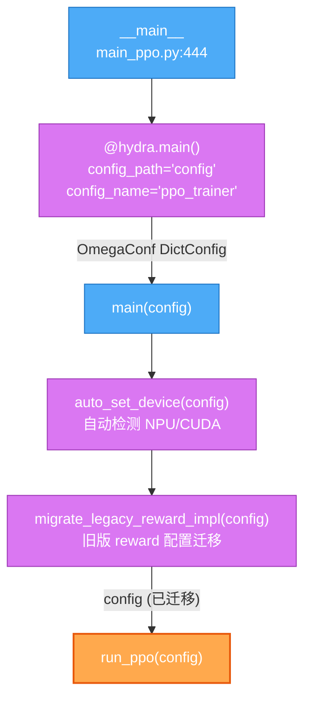

## 2. `run_ppo` → Ray 集群初始化 & TaskRunner 远程执行

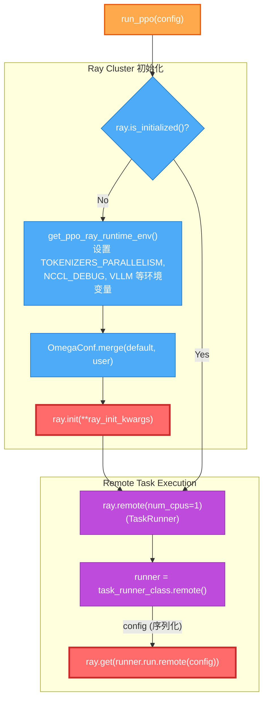

## 3. `TaskRunner.run()` — 完整的初始化编排

这是在 **Ray Worker 节点**上远程执行的主初始化逻辑。

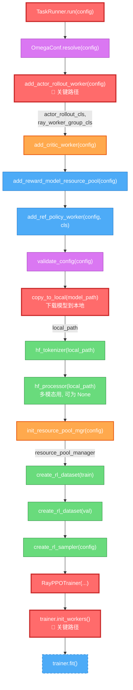

## 4. Worker 角色映射构建

`TaskRunner` 的几个 `add_*` 方法负责填充 `role_worker_mapping` 和 `mapping` 两个字典。

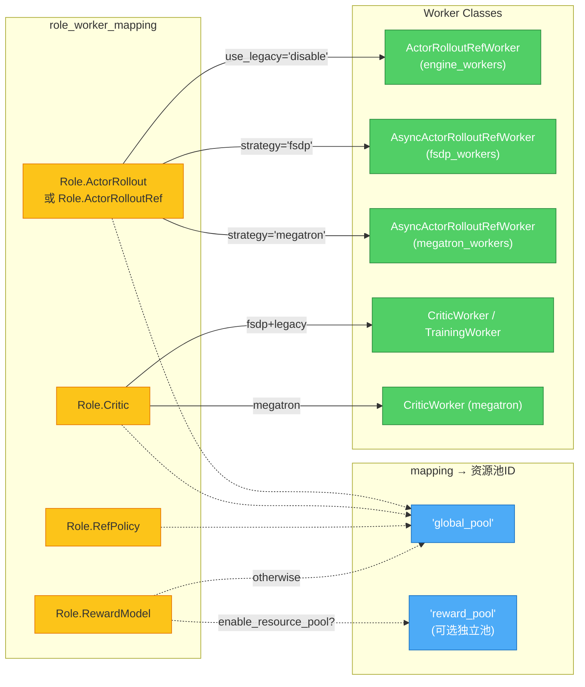

### Actor/Rollout Worker 选择逻辑

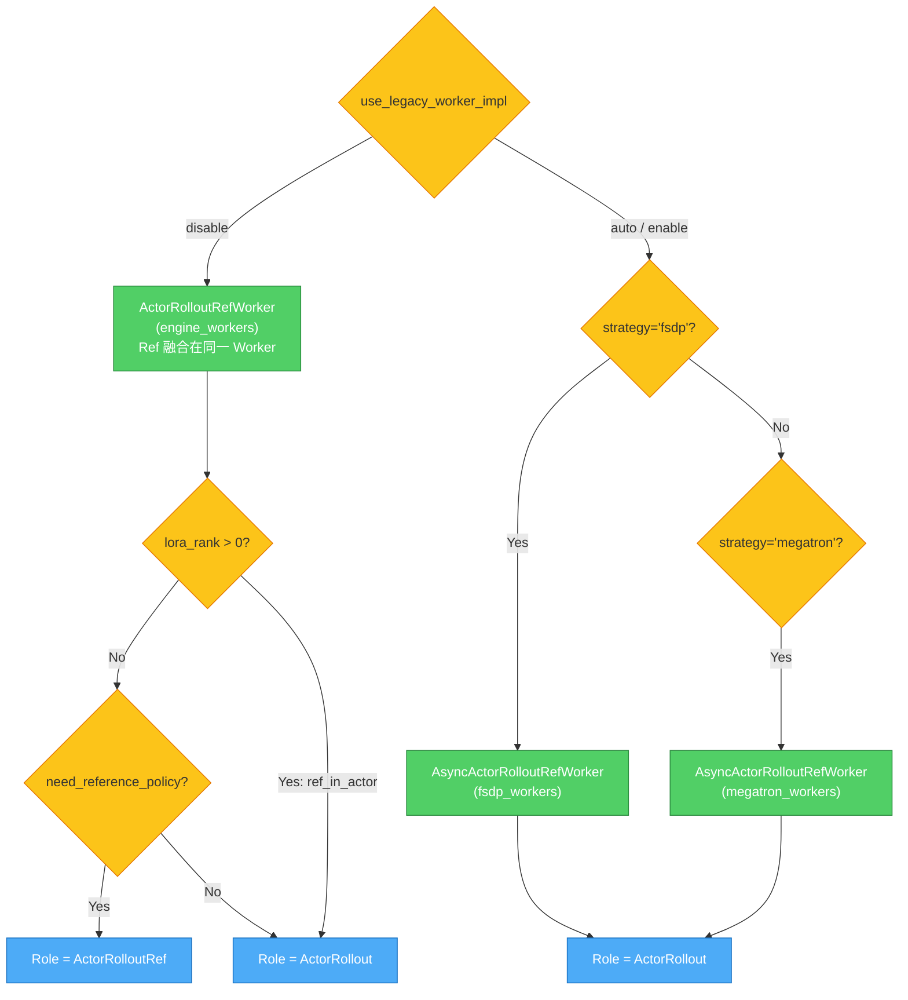

## 5. `RayPPOTrainer.__init__()` — 构造函数

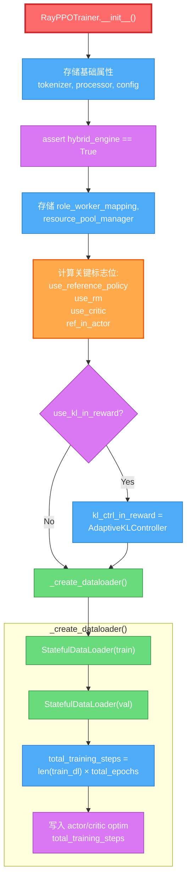

## 6. `RayPPOTrainer.init_workers()` — 🔴 核心初始化路径

这是耗时最长、逻辑最复杂的初始化步骤。

```mermaid
flowchart TD
    classDef critical fill:#ff6b6b,stroke:#c92a2a,color:#fff,stroke-width:3px
    classDef important fill:#ffa94d,stroke:#e8590c,color:#fff,stroke-width:2px
    classDef normal fill:#4dabf7,stroke:#1971c2,color:#fff
    classDef data fill:#69db7c,stroke:#2b8a3e,color:#fff
    classDef ray fill:#be4bdb,stroke:#862e9c,color:#fff

    IW["init_workers()"]:::critical

    subgraph PHASE1 ["Phase 1: 创建资源池"]
        direction TB
        CREATE_RP["resource_pool_manager<br/>.create_resource_pool()<br/>创建 PlacementGroup"]:::critical
        INIT_CLS_MAP["初始化<br/>resource_pool_to_cls = {}"]:::normal
    end

    subgraph PHASE2 ["Phase 2: RayClassWithInitArgs 包装"]
        direction TB
        WRAP_AR["RayClassWithInitArgs(<br/>ActorRollout Worker,<br/>config, role)"]:::important
        WRAP_CR["RayClassWithInitArgs(<br/>CriticWorker, config)"]:::important
        WRAP_REF["RayClassWithInitArgs(<br/>RefPolicy Worker,<br/>config, role)"]:::normal
    end

    subgraph PHASE3 ["Phase 3: 创建 WorkerGroup"]
        direction TB
        COLOCATE["create_colocated_worker_cls()<br/>=> WorkerDict (代理类)"]:::critical
        WG_INIT["RayWorkerGroup(<br/>resource_pool,<br/>worker_dict_cls)"]:::critical
        SPAWN["wg.spawn(prefix_set)<br/>按角色名拆分 WorkerGroup"]:::important
    end

    subgraph PHASE4 ["Phase 4: 模型初始化"]
        direction TB
        CRITIC_INIT["critic_wg.init_model()"]:::critical
        REF_INIT["ref_policy_wg.init_model()<br/>(如需要)"]:::important
        ACTOR_INIT["actor_rollout_wg.init_model()<br/>🔴 最后初始化<br/>(vLLM 需要估算 KV cache)"]:::critical
    end

    subgraph PHASE5 ["Phase 5: 管理器初始化"]
        direction TB
        REWARD_LOOP["RewardLoopManager(config, pool)<br/>创建 RewardLoopWorker×N"]:::important
        AGENT_LOOP["AgentLoopManager.create()<br/>创建 RolloutReplica,<br/>初始化 LLM Server,<br/>创建 AgentLoopWorker×N"]:::critical
        CKPT_MGR["CheckpointEngineManager(<br/>config, trainer_wg, replicas)"]:::important
        SLEEP["checkpoint_manager<br/>.sleep_replicas()"]:::normal
    end

    IW --> CREATE_RP
    CREATE_RP --> INIT_CLS_MAP
    INIT_CLS_MAP --> WRAP_AR
    WRAP_AR --> WRAP_CR
    WRAP_CR --> WRAP_REF
    WRAP_REF --> COLOCATE
    COLOCATE --> WG_INIT
    WG_INIT --> SPAWN
    SPAWN --> CRITIC_INIT
    CRITIC_INIT --> REF_INIT
    REF_INIT --> ACTOR_INIT
    ACTOR_INIT --> REWARD_LOOP
    REWARD_LOOP --> AGENT_LOOP
    AGENT_LOOP --> CKPT_MGR
    CKPT_MGR --> SLEEP
```

## 7. 核心基础设施层次关系

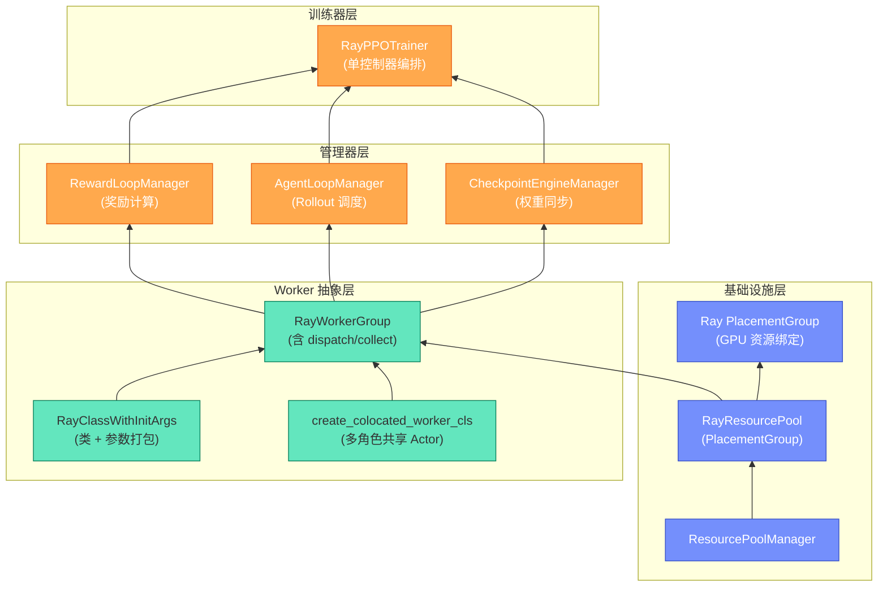

## 8. 完整数据流向

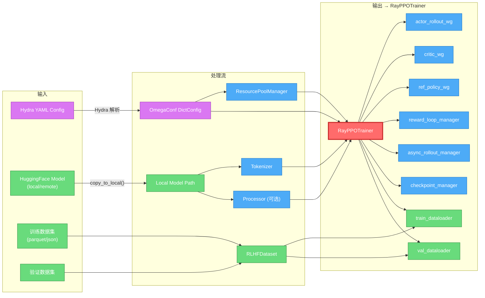

## 9. `create_colocated_worker_cls` 协同部署机制

> [!NOTE]
> 这是 verl 的核心设计——将多个角色 (Actor/Critic/Ref) 打包到同一个 Ray Actor 中，共享 GPU 资源。

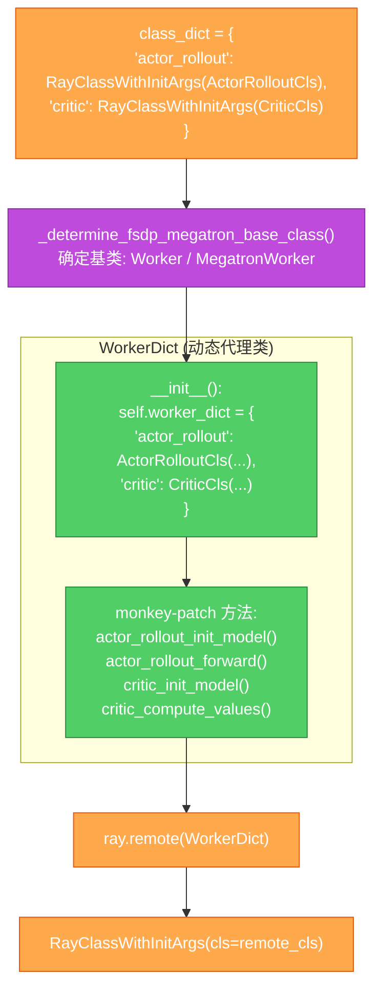

## 10. `AgentLoopManager.create()` 异步初始化

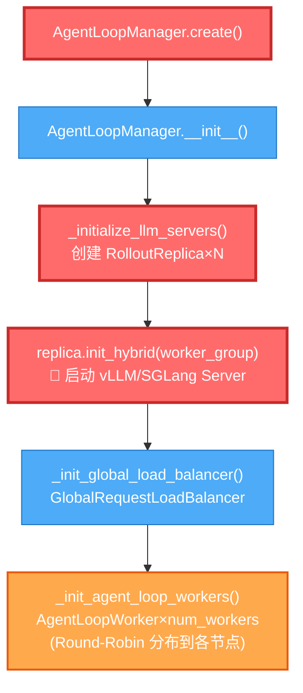

---

## 关键文件索引

| 组件 | 文件路径 |
|------|---------|
| 入口 main_ppo | [main_ppo.py](file:///home/robomaster/Research/verl/verl/trainer/main_ppo.py) |
| RayPPOTrainer | [ray_trainer.py](file:///home/robomaster/Research/verl/verl/trainer/ppo/ray_trainer.py) |
| Role 枚举 | [utils.py](file:///home/robomaster/Research/verl/verl/trainer/ppo/utils.py) |
| Ray 基础设施 | [base.py](file:///home/robomaster/Research/verl/verl/single_controller/ray/base.py) |
| RewardLoopManager | [reward_loop.py](file:///home/robomaster/Research/verl/verl/experimental/reward_loop/reward_loop.py) |
| AgentLoopManager | [agent_loop.py](file:///home/robomaster/Research/verl/verl/experimental/agent_loop/agent_loop.py) |
| CheckpointEngineManager | [base.py](file:///home/robomaster/Research/verl/verl/checkpoint_engine/base.py) |
| PPO 运行时常量 | [constants_ppo.py](file:///home/robomaster/Research/verl/verl/trainer/constants_ppo.py) |
