# verl PPO 初始化时序图

## `main_ppo` → `RayPPOTrainer.init_workers()` 完整时序

```mermaid
sequenceDiagram
    autonumber

    participant DRV  as Driver Process<br/>(main_ppo.py)
    participant RAY  as Ray Cluster
    participant TR   as TaskRunner<br/>(Ray Remote Actor)
    participant RPM  as ResourcePoolManager
    participant RWG  as RayWorkerGroup
    participant W    as Worker Actors<br/>(ActorRollout/Critic/Ref)
    participant RLM  as RewardLoopManager
    participant ALM  as AgentLoopManager
    participant CEM  as CheckpointEngineManager

    %% ── Phase 0: 启动 & Hydra 配置 ──────────────────────────────
    rect rgb(60, 60, 80)
        Note over DRV: Phase 0 — 启动 & Hydra 配置加载
        DRV ->> DRV: @hydra.main()<br/>加载 config/ppo_trainer.yaml
        DRV ->> DRV: auto_set_device(config)
        DRV ->> DRV: migrate_legacy_reward_impl(config)<br/>迁移旧版 reward_model 配置字段
        DRV ->> DRV: run_ppo(config)
    end

    %% ── Phase 1: Ray 集群初始化 ────────────────────────────────
    rect rgb(80, 40, 40)
        Note over DRV, RAY: Phase 1 — Ray 集群初始化 🔴 关键路径
        DRV ->> DRV: get_ppo_ray_runtime_env()<br/>构建 env_vars (NCCL/VLLM等)
        DRV ->> RAY: ray.init(runtime_env, num_cpus, ...)
        RAY -->> DRV: 集群就绪
    end

    %% ── Phase 2: TaskRunner 远程部署 ───────────────────────────
    rect rgb(40, 60, 80)
        Note over DRV, TR: Phase 2 — TaskRunner 远程执行
        DRV ->> RAY: ray.remote(num_cpus=1)(TaskRunner)
        DRV ->> RAY: runner = task_runner_cls.remote()
        RAY ->> TR: 创建 TaskRunner Actor
        TR -->> RAY: Actor 句柄
        DRV ->> RAY: ray.get(runner.run.remote(config))
        Note right of DRV: Driver 阻塞等待<br/>直到 TaskRunner.run() 完成
    end

    %% ── Phase 3: Worker 角色映射构建 ───────────────────────────
    rect rgb(60, 80, 40)
        Note over TR: Phase 3 — Worker 角色映射构建
        TR ->> TR: add_actor_rollout_worker(config)
        Note right of TR: 根据 use_legacy_worker_impl<br/>和 actor.strategy 选择:<br/>• fsdp → AsyncActorRolloutRefWorker<br/>• megatron → AsyncActorRolloutRefWorker<br/>• disable → ActorRolloutRefWorker<br/>填充 role_worker_mapping[Role.ActorRollout]

        TR ->> TR: add_critic_worker(config)
        Note right of TR: 根据 critic.strategy 选择:<br/>• fsdp+legacy → CriticWorker<br/>• fsdp+disable → TrainingWorker<br/>• megatron → CriticWorker(megatron)<br/>填充 role_worker_mapping[Role.Critic]

        TR ->> TR: add_reward_model_resource_pool(config)
        Note right of TR: reward_model.enable=True 时<br/>填充 mapping[Role.RewardModel]<br/>→ 'reward_pool' 或 'global_pool'

        TR ->> TR: add_ref_policy_worker(config)
        Note right of TR: use_kl_in_reward 或 use_kl_loss 时<br/>填充 role_worker_mapping[Role.RefPolicy]

        TR ->> TR: validate_config(config, use_ref, use_critic)
    end

    %% ── Phase 4: 模型 & 数据准备 ──────────────────────────────
    rect rgb(80, 60, 40)
        Note over TR: Phase 4 — 模型与数据集准备 🔴 关键路径
        TR ->> TR: copy_to_local(model.path)<br/>从 HDFS/远程下载模型到本地
        TR ->> TR: hf_tokenizer(local_path)
        TR ->> TR: hf_processor(local_path)<br/>多模态时非 None
        TR ->> TR: init_resource_pool_mgr(config)
        Note right of TR: resource_pool_spec = {<br/>  'global_pool': [n_gpus_per_node] × nnodes,<br/>  'reward_pool': [...] (可选)<br/>}<br/>构建 ResourcePoolManager

        TR ->> TR: create_rl_dataset(train_files, ...)
        Note right of TR: get_dataset_class(data_config)<br/>实例化 RLHFDataset

        TR ->> TR: create_rl_dataset(val_files, ...)
        TR ->> TR: create_rl_sampler(config, train_dataset)<br/>RandomSampler / SequentialSampler
    end

    %% ── Phase 5: RayPPOTrainer 构造 ────────────────────────────
    rect rgb(40, 80, 80)
        Note over TR, RWG: Phase 5 — RayPPOTrainer.__init__()
        TR ->> TR: RayPPOTrainer(config, tokenizer, role_worker_mapping,<br/>resource_pool_manager, ray_worker_group_cls,<br/>train_dataset, val_dataset, collate_fn, train_sampler)

        Note right of TR: 计算标志位:<br/>• use_reference_policy = use_kl_in_reward ∥ use_kl_loss<br/>• use_rm = reward_model.enable<br/>• use_critic = critic.enable ∥ adv=GAE<br/>• ref_in_actor = lora_rank > 0

        TR ->> TR: _create_dataloader()<br/>StatefulDataLoader(train) + StatefulDataLoader(val)
        Note right of TR: total_training_steps =<br/>len(train_dl) × total_epochs<br/>写入 actor/critic optim 配置
    end

    %% ── Phase 6: init_workers ──────────────────────────────────
    rect rgb(80, 40, 80)
        Note over TR, W: Phase 6 — init_workers() 🔴 核心关键路径

        TR ->> RPM: resource_pool_manager.create_resource_pool()
        RPM ->> RAY: placement_group(bundles, strategy='STRICT_PACK')
        RAY -->> RPM: PlacementGroup × N (每节点一个)
        RPM ->> RAY: ray.get([pg.ready() for pg in pgs])
        RAY -->> RPM: 所有 PG 就绪
        RPM -->> TR: resource_pool_dict 已填充

        TR ->> TR: RayClassWithInitArgs(ActorRolloutCls, config, role)<br/>RayClassWithInitArgs(CriticCls, config)<br/>RayClassWithInitArgs(RefPolicyCls, config, role)
        Note right of TR: 按 resource_pool 分组:<br/>resource_pool_to_cls[pool] = {role: cls}

        loop 每个 resource_pool
            TR ->> TR: create_colocated_worker_cls(class_dict)
            Note right of TR: 动态构建 WorkerDict 代理类<br/>将 Actor/Critic/Ref 打包进<br/>同一个 Ray Actor 以共享 GPU

            TR ->> RWG: RayWorkerGroup(resource_pool, WorkerDict, ...)
            RWG ->> RAY: 为每个 rank 调用 ray_cls_with_init()<br/>ray.remote(WorkerDict).options(PG_strategy).remote()
            RAY ->> W: 在对应 PlacementGroup bundle 上创建 Actor
            W -->> RWG: Actor 句柄列表
            RWG ->> RWG: _bind_worker_method()<br/>为所有 Worker 方法生成 dispatch/collect 包装

            TR ->> RWG: wg.spawn(prefix_set)<br/>按角色名拆分出子 WorkerGroup
            RWG -->> TR: all_wg = {'actor_rollout': wg, 'critic': wg, ...}
        end

        Note over TR, W: 模型初始化顺序 (固定): Critic → RefPolicy → ActorRollout
        TR ->> RWG: critic_wg.init_model()
        RWG ->> W: [w.init_model.remote() for w in workers]
        W -->> RWG: 模型加载完成
        RWG -->> TR: done

        TR ->> RWG: ref_policy_wg.init_model()
        RWG ->> W: [w.init_model.remote() for w in workers]
        W -->> RWG: done
        RWG -->> TR: done

        TR ->> RWG: actor_rollout_wg.init_model()
        Note right of W: 🔴 最后初始化<br/>vLLM/SGLang 在此时<br/>启动推理引擎并估算 KV Cache
        RWG ->> W: [w.init_model.remote() for w in workers]
        W -->> RWG: 推理引擎就绪
        RWG -->> TR: done
    end

    %% ── Phase 7: 管理器链初始化 ────────────────────────────────
    rect rgb(40, 40, 80)
        Note over TR, CEM: Phase 7 — 管理器链初始化
        TR ->> RLM: RewardLoopManager(config, rm_resource_pool)
        Note right of RLM: 若 reward_model.enable:<br/>  RewardModelManager(启动 RM 推理服务)<br/>获取 reward_router_address<br/>创建 RewardLoopWorker × num_workers<br/>Round-Robin 分布到各节点
        RLM -->> TR: reward_loop_manager

        TR ->> ALM: AgentLoopManager.create(config, actor_wg, pool, reward_workers)
        Note right of ALM: 1. __init__(): 确定 rollout_replica_class<br/>2. _initialize_llm_servers():<br/>   创建 RolloutReplica × (world_size / tp_size)<br/>   replica.init_hybrid(actor_rollout_wg)<br/>   🔴 vLLM/SGLang Server 正式启动<br/>   收集 server_addresses<br/>3. _init_global_load_balancer():<br/>   GlobalRequestLoadBalancer.remote()<br/>4. _init_agent_loop_workers():<br/>   AgentLoopWorker × num_workers
        ALM -->> TR: async_rollout_manager

        TR ->> CEM: CheckpointEngineManager(config, actor_wg, rollout_replicas)
        Note right of CEM: 绑定 trainer=actor_rollout_wg<br/>绑定 replicas=rollout_replicas 列表
        CEM -->> TR: checkpoint_manager

        TR ->> CEM: checkpoint_manager.sleep_replicas()
        Note right of CEM: await asyncio.gather(*[r.sleep() for r in replicas])<br/>释放 Rollout 的 KV Cache 显存<br/>等待 Checkpoint 权重加载完成
        CEM -->> TR: 所有 Replica 进入睡眠
    end

    %% ── 完成 ────────────────────────────────────────────────────
    Note over TR: ✅ init_workers() 完成<br/>RayPPOTrainer 完全就绪
    TR -->> DRV: (ray.get 返回)
    DRV ->> TR: runner.run 已完成，进入 trainer.fit()
```

---

## 参与者说明

| 参与者 | 对应代码 | 运行位置 |
|--------|---------|---------|
| **Driver Process** | `main_ppo.py::run_ppo()` | Head Node 单进程 |
| **Ray Cluster** | Ray 调度系统 | 集群全局 |
| **TaskRunner** | `main_ppo.py::TaskRunner` | Ray Remote Actor (Worker Node) |
| **ResourcePoolManager** | `ray/base.py::ResourcePoolManager` | Driver 对象，调度逻辑在集群 |
| **RayWorkerGroup** | `ray/base.py::RayWorkerGroup` | Driver 对象，管理远端 Actor |
| **Worker Actors** | `fsdp_workers / megatron_workers / engine_workers` | GPU Worker 节点 |
| **RewardLoopManager** | `experimental/reward_loop/reward_loop.py` | Driver 对象 + CPU Actors |
| **AgentLoopManager** | `experimental/agent_loop/agent_loop.py` | Driver 对象 + GPU/CPU Actors |
| **CheckpointEngineManager** | `checkpoint_engine/base.py` | Driver 对象，协调 Trainer↔Rollout |

## 关键路径时间线

```mermaid
gantt
    title 初始化关键路径耗时分布（示意）
    dateFormat  X
    axisFormat %s

    section 配置 & 环境
    Hydra 配置加载          : 0, 1
    Ray cluster init        : crit, 1, 4

    section 模型准备
    copy_to_local (模型下载)  : crit, 4, 12
    hf_tokenizer/processor   : 12, 13

    section 资源分配
    create_resource_pool (PG) : crit, 13, 16

    section Worker 启动
    create_colocated_worker   : 16, 18
    RayWorkerGroup spawn      : crit, 18, 22

    section 模型加载
    critic_wg.init_model      : crit, 22, 28
    ref_policy_wg.init_model  : 28, 32
    actor_rollout_wg.init_model : crit, 32, 45

    section 管理器
    RewardLoopManager init    : 45, 47
    AgentLoopManager.create   : crit, 47, 58
    CheckpointEngineManager   : 58, 59
    sleep_replicas            : 59, 61
```

